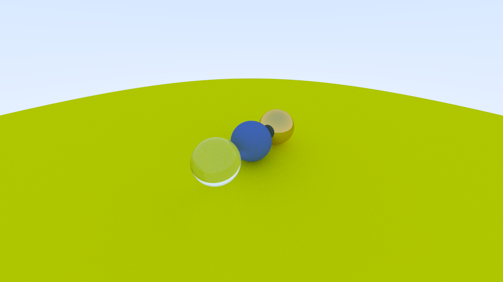

# x, y, z 2-tuples with volumetric colors in a baseline cube

(x, y), (x, z), (y, z)

* Every axis is one of the RGB. E.g: (x, y) => (r, g)
* The center of the screen is in the origin of the local space of the baseline cube
* For every frame, draw the 3 images

* or just send the origin of the screen

* same camera, scene is an infinite square at a fixed distance from the camera (origin of the local cube space), and colors are how distant from the camera the point is

